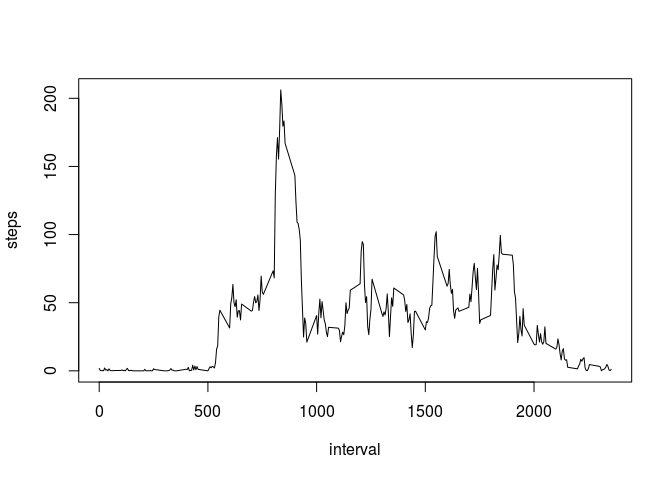

# Reproducible Research: Peer Assessment 1


## Loading and preprocessing the data


```r
#Download and unzip the data file
address <- "https://d396qusza40orc.cloudfront.net/repdata%2Fdata%2Factivity.zip"
address <- sub("^https", "http", address) #https does not work
zipname <- "activity.zip"
download.file(address,zipname)
unzip(zipname)
csvname <- "activity.csv"
activity <- read.csv(csvname)

#housekeeping - remove the zip as it is no longer needed
file.remove(zipname, csvname)
```

```
## [1] TRUE TRUE
```

```r
#housekeeping
rm(address, zipname, csvname)
```


```r
#Convert string to hours and minutes
#library(lubridate)
#activity$time <- hm(paste(
#    substr(activity$interval+10000,2,3),
#    substr(activity$interval+10000,4,5)
#    )
#  )
```


## What is mean total number of steps taken per day?


```r
stepsperdate <- (aggregate(steps ~ date, data=activity, sum))
hist(stepsperdate$steps, breaks=10)
```

 

```r
mean(stepsperdate$steps)
```

```
## [1] 10766.19
```

```r
median(stepsperdate$steps)
```

```
## [1] 10765
```


## What is the average daily activity pattern?


```r
meanstepsperinterval <- (aggregate(steps ~ interval, data=activity, mean))
plot(meanstepsperinterval, type="l")
```

 


## Imputing missing values

```r
sum(is.na(activity$steps))
```

```
## [1] 2304
```

```r
intervals_missing_steps <- activity$interval[is.na(activity$steps)]
means_for_missing_steps <-
sapply(intervals_missing_steps,
       function(x) meanstepsperinterval$steps[
         meanstepsperinterval$interval==x
       ]
       )

new_activity <- activity
new_activity$steps[is.na(new_activity$steps)] <- means_for_missing_steps

head(activity)
```

```
##   steps       date interval
## 1    NA 2012-10-01        0
## 2    NA 2012-10-01        5
## 3    NA 2012-10-01       10
## 4    NA 2012-10-01       15
## 5    NA 2012-10-01       20
## 6    NA 2012-10-01       25
```

```r
head(new_activity)
```

```
##       steps       date interval
## 1 1.7169811 2012-10-01        0
## 2 0.3396226 2012-10-01        5
## 3 0.1320755 2012-10-01       10
## 4 0.1509434 2012-10-01       15
## 5 0.0754717 2012-10-01       20
## 6 2.0943396 2012-10-01       25
```


```r
new_stepsperdate <- (aggregate(steps ~ date, data=new_activity, sum))
hist(new_stepsperdate$steps, breaks=10)
```

 

```r
mean(new_stepsperdate$steps)
```

```
## [1] 10766.19
```

```r
median(new_stepsperdate$steps)
```

```
## [1] 10766.19
```


## Are there differences in activity patterns between weekdays and weekends?

```r
library(lubridate)

activity$weekdays <- weekdays(ymd(activity$date))

activity$weekend <- "weekday"
activity$weekend[activity$weekdays %in%
                 c("Saturday","Sunday") ] <- "weekend"

meanstepsweekend <- (aggregate(steps ~ interval + weekend,
                               data=activity, mean))

library(lattice)
xyplot(steps ~ interval | weekend,
       data=meanstepsweekend,
       layout=c(1,2,1),
       panel=panel.lines)
```

 


